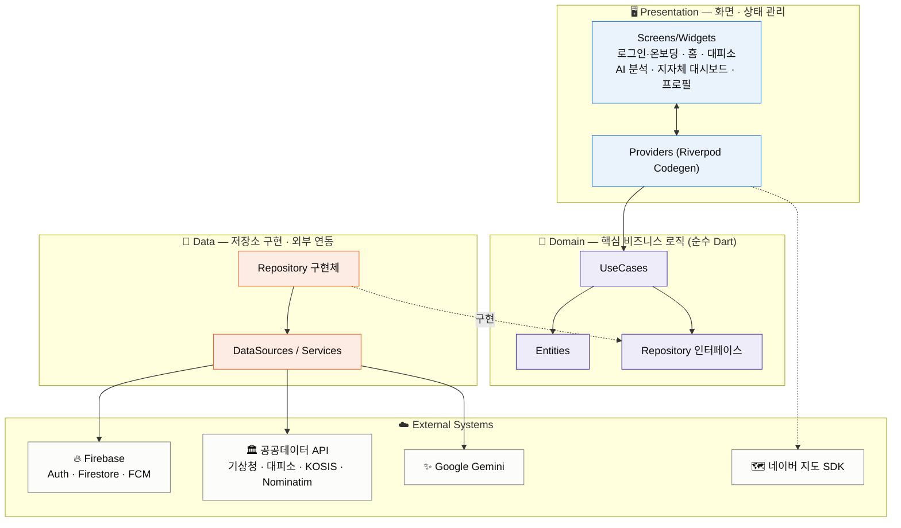

<div align="center">


# 🌡️ ClimaGuard

**연령별 맞춤형 재난 예측 · 대피 큐레이션 플랫폼**

폭염·한파로 인한 온열·한랭질환을 개인의 나이와 기저질환까지 반영해 예측하고,
가까운 대피소 안내부터 지자체 대응까지 이어주는 Flutter 앱입니다.

**현재 AOS 집중 개발**

[](https://flutter.dev)
[](https://riverpod.dev)
[](https://firebase.google.com)
[](https://ai.google.dev)
[]()


</div>

---

## 📖 소개

기존 폭염·한파 특보는 **모든 사람에게 동일한 기준**을 적용합니다. 하지만 영유아·고령층·기저질환자는
같은 기온에서도 체감하는 위험도가 전혀 다릅니다. ClimaGuard는 기상청 실측 기온을 기반으로 **개인의 연령·기저질환에 맞춘 체감 위험도**를 계산하고, 위험 단계에 따라 가까운 쉼터 안내 · AI 행동 가이드 · 지자체 대응 프로토콜까지 하나의 흐름으로 제공합니다.

## ✨ 주요 기능

| 기능 | 설명 |
|---|---|
| 🌡️ **온도 기반 3구간 자동 판단** | 기상청 API 실측 기온으로 폭염(>24°C) / 한파(<14°C) / 일반(14~24°C)을 자동 전환 — 수동 설정 불필요 |
| 🧑‍🤝‍🧑 **연령·기저질환별 맞춤 보정** | 영유아·청소년·성인·고령·초고령 5개 그룹 + 심혈관·당뇨·호흡기·고혈압·신장·비만 보정을 독립 적용 |
| 🏠 **홈 대시보드** | 체감온도, 4단계 위험도 링, 행동 메시지, 시간대별 기온 추이를 한 화면에 표시 |
| 🧭 **대피소 안내** | 무더위/한파 쉼터를 목록·네이버 지도로 탐색, 마커 탭 한 번으로 길안내 연결 |
| 🤖 **AI 위험 분석** | Google Gemini가 개인 상황에 맞춘 위험 설명과 행동 가이드 생성 (실패 시 룰 기반 문구로 자동 폴백) |
| 📊 **지자체 대시보드** | 경기도 31개 시군·읍면동 단위 위험 인원을 실제 인구(KOSIS) 기반으로 투영, Choropleth 지도로 시각화 |
| 🛡️ **AI 대응 프로토콜** | 지역·시즌별 위험 인원 분포를 바탕으로 지자체가 취할 대응 조치를 Gemini가 자동 생성 |
| 📈 **집단 학습** | 사용자 피드백(괜찮음/힘듦/매우힘듦)이 쌓일수록 연령 그룹별 임계치가 점진적으로 보정 |
| 🔔 **알림** | 임계치 초과 시 로컬/푸시 알림으로 위험 상황 안내 |

## 📱 스크린샷

<table>
<tr>
<td align="center" width="20%"><br/><sub>전화번호 OTP 로그인</sub></td>
<td align="center" width="20%"><br/><sub>온보딩 · 지역 선택</sub></td>
<td align="center" width="20%"><br/><sub>홈 · 폭염 위험 단계</sub></td>
<td align="center" width="20%"><br/><sub>홈 · 한파 위험 단계</sub></td>
<td align="center" width="20%"><br/><sub>AI 위험 분석</sub></td>
</tr>
<tr>
<td align="center"><br/><sub>대피소 지도</sub></td>
<td align="center"><br/><sub>대피소 목록</sub></td>
<td align="center"><br/><sub>지자체 대시보드</sub></td>
<td align="center"><br/><sub>AI 대응 프로토콜</sub></td>
<td align="center"><br/><sub>프로필 · 임계치 확인</sub></td>
</tr>
</table>

> 더 많은 화면은 [`docs/screenshots/`](docs/screenshots) 폴더에서 확인할 수 있습니다.

## 🧑‍🤝‍🧑 연령·기저질환별 보정 매트릭스

기상청 공식 기준(성인, 0°C 보정)을 기준선으로 아래 값만큼 개인화된 임계치를 계산합니다.

| 그룹 | 연령 | 폭염 보정 | 한파 보정 | 근거 |
|---|---|---|---|---|
| 영유아 | 0~9세 | -3.0°C | +3.0°C | 체온조절 미숙 |
| 청소년 | 10~17세 | -1.5°C | +1.5°C | 체온조절 발달 중 |
| 성인 | 18~64세 | 0°C (기준) | 0°C (기준) | 기상청 공식 기준 |
| 고령 | 65~74세 | -3.0°C | +3.0°C | 땀샘 감소, 질병관리청 통계 |
| 초고령 | 75세↑ | -4.5°C | +4.5°C | 한파 사망 78.6% 집중 |

기저질환(심혈관·당뇨·호흡기·고혈압·신장·비만)별 보정치가 추가로 독립 적용되며, 여기에 개인이 남긴 체감 피드백이 누적되어 임계치가 점진적으로 보정됩니다.

## 🏗️ 아키텍처

Clean Architecture(Presentation / Domain / Data) + Firebase + 공공데이터·AI API 연동 구조입니다.



- **의존성 역전**: Domain은 Repository "인터페이스"만 알고, Data가 이를 구현 → Domain은 Firebase/외부 API 변경에 영향받지 않음
- **서버리스 집단 학습**: 클라이언트 + Firestore 트랜잭션 락으로 처리, Cloud Function 미사용
- **AI 장애 내성**: Gemini 응답 실패 시 앱이 죽지 않고 룰 기반 하드코딩 텍스트로 자동 폴백

더 자세한 다이어그램은 [`docs/architecture/`](docs/architecture)를 참고하세요.

## 🛠️ 기술 스택

| 분류 | 사용 기술 |
|---|---|
| 프레임워크 | Flutter 3.12 (Dart) |
| 상태관리 | Riverpod 2.6 + riverpod_generator (Codegen) |
| 라우팅 | go_router |
| 데이터 모델 | Freezed + json_serializable |
| 네트워크 | Dio |
| 인증/DB/푸시 | Firebase (Auth 전화 OTP, Firestore, Cloud Messaging) |
| AI | Google Gemini (`gemini-1.5-flash-latest`) |
| 지도 | 네이버 Dynamic Map SDK (`flutter_naver_map`) |
| 위치/역지오코딩 | Geolocator, Nominatim(OSM) |
| 로컬 저장 | SharedPreferences, flutter_local_notifications |
| 외부 공공데이터 | 기상청 단기예보, 행안부 대피소, 통계청 KOSIS |

## 📂 폴더 구조

```
lib/
├── core/            # 상수, 테마, 유틸리티 (GeoJSON 로더, 역지오코딩 등)
├── data/            # datasources, models, repository 구현체
├── domain/          # entities, usecases, repository 인터페이스 (순수 Dart)
└── presentation/    # providers, screens, widgets
```

## 🚀 시작하기

### 요구 사항
- Flutter SDK `^3.12.0`
- Firebase 프로젝트 (`flutterfire configure`로 `firebase_options.dart` 생성)

### 설치

```bash
git clone https://github.com/<your-org>/climaguard.git
cd climaguard
flutter pub get
```

### 환경 변수 설정

`.env.example`을 복사해 `.env`를 만들고 발급받은 키를 채워주세요.

```bash
cp .env.example .env
```

| 변수 | 설명 |
|---|---|
| `KMA_API_KEY` | 기상청 공공데이터포털 단기예보 API 키 |
| `SHELTER_API_KEY` | 행안부 무더위·한파쉼터 API 키 |
| `GEMINI_API_KEY` | Google Gemini API 키 |
| `NAVER_DYNAMICMAP_CLIENT_ID` | 네이버 클라우드 플랫폼 Dynamic Map Client ID |
| `KOSIS_API_KEY` | 통계청 KOSIS Open API 인증키 |

### 코드 생성 & 실행

```bash
# riverpod | freezed 전용 codegen
dart run build_runner build --delete-conflicting-outputs
flutter run
```
<div align="center">

Made for the safety of those most vulnerable to extreme temperatures 🌡️

</div>
